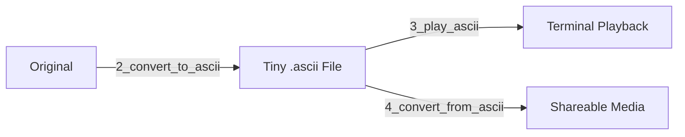

# img-vid-ascii: Next-Gen ASCII Art Transformation 🔄🎨

**Transform images and videos into stunning ASCII and unicode art and back** with speed and quality. This isn't just another converter - it's a complete toolkit that preserves audio, maintains quality, and delivers performance.

[](https://raw.githubusercontent.com/2dameneko/img-vid-ascii/main/samples/video/Bad_Apple_PV_demo.ascii_demo.mp4)

## Why This Stands Out ✨

**🎭 Dual Media Magic**  
Convert **both images AND videos** seamlessly with a single utility. Your favorite images and clips become mesmerizing ASCII art in seconds.


**💾 Ultra-Compact .ascii Format**  
Share creations that are **10–100× smaller** than originals! A 50MB video becomes a 1.5MB `.ascii` file — perfect for messaging and storage.

**🔊 Perfect Audio Preservation**  
Enjoy videos with **original, untouched audio quality**. Soundtracks remain crystal clear and perfectly synced.

**⏩ Lightning-Fast Processing**  
Experience **3–5× realtime conversion speeds**. GPU acceleration makes reconstruction back to MP4 blazing fast.


## Key Dependencies ⚙️

**OpenCV-Python**  
Handles core media processing — image/video loading, grayscale conversion, and smart contrast enhancement.

**FFmpeg-Downloader**  
Automatically installs and configures FFmpeg for seamless audio extraction and embedding without quality loss.

**Numba**  
Supercharges reconstruction with JIT compilation, delivering GPU-like speeds for ASCII-to-video conversion.

**Pillow**  
Powers professional font rendering during reconstruction, supporting custom character sets and anti-aliased text.

**🔄 Complete Round-Trip Workflow**  


**🎨 Unlimited Creativity**  
Choose from any character sets or create your own! Specialized fonts bring runic symbols and geometric shapes to life.


## Quick Start 🚀

1. **Install**  
   ```bash
   git clone https://github.com/2dameneko/img-vid-ascii
   cd img-vid-ascii
   0_install
   ```

2. **Convert & Play**  
   ```bash
   2_convert_to_ascii "your_video.mp4"
   3_play_ascii "your_video.ascii"
   ```

[](https://raw.githubusercontent.com/2dameneko/img-vid-ascii/main/samples/video/dance_mixer_standard.ascii_demo.mp4)

3. **Share Everywhere**  
   ```bash
   convert_from_ascii "your_video.ascii"
   ```

**Share**  
Send the tiny `.ascii` file to friends — they'll see the full show with original audio!


**Transform Back**  
Create a viral social media version from the reconstructed MP4.

## Technical Details ⚙️

**Audio Perfection**  
Original audio extracted without re-encoding.

**GPU-Powered Reconstruction**  
Supports NVIDIA CUDA, AMD AMF, and Intel QSV for fast conversion.

**Smart Compression**  
Internal ZIP-based format with metadata and audio preservation.

## Character Gallery 🖼️

  


## Video Showcase 🎥

[](https://raw.githubusercontent.com/2dameneko/img-vid-ascii/main/samples/video/ZAKO_blocks.ascii_demo.mp4)

## Join the ASCII Revolution! 💻➡️🎨
Rediscover your media through the beauty of ASCII!

## License
[Apache License 2.0](https://www.apache.org/licenses/LICENSE-2.0)

## Credits
* FFmpeg: [FFmpeg](https://ffmpeg.org/)
* Runic font: [BabelStone Runic](https://www.babelstone.co.uk/Fonts/Runic.html)
* Monospace font: [Inconsolata](https://github.com/googlefonts/Inconsolata)